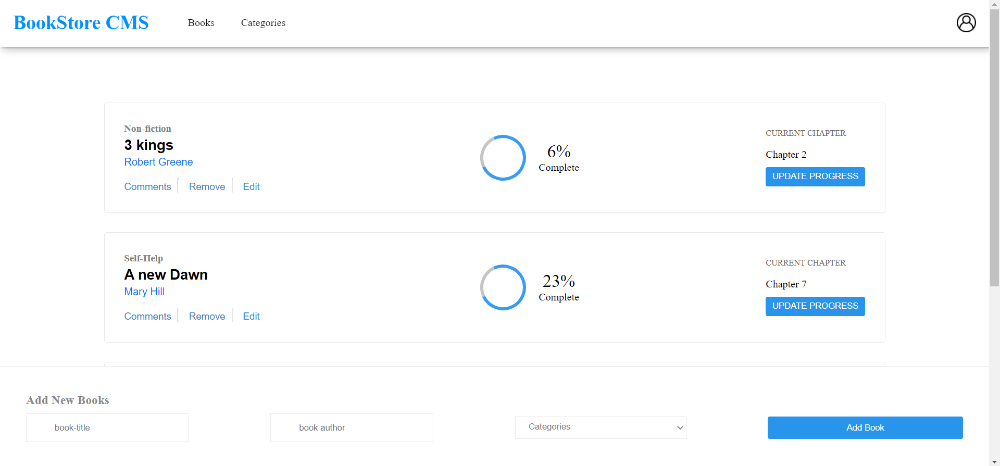

# Bookstore

The Bookstore is a website that displays books available in bookstore. It tells you about the author,the genre of the book and chapter details. The site contain these features : list of books, add a book and remove a selected book.

Check the live demo [here](https://usorfaitheloho-book-store.netlify.app)

## Project List

- [x] Initialize project with components (React only).
- [x] Add reducers and actions.
- [x] Use Redux in React components.
- [x] Connect to API.
- [x] Styling.

## Built with
- React
- CSS3

## Getting Started
To get a local copy up and running follow the steps below

### 
- clone this repo by copy pasting this on your terminal ``git clone https://github.com/usorfaitheloho/book-store.git``

- open the project folder 'cd book-store'
- Run 'npm install' to install all dependencies
- Run 'npm start' to start the live server

## Author
**Faith Usor**
- GitHub: [@faith-usor](https://github.com/usorfaitheloho)
- Twitter: [@faith-usor](https://twitter.com/Faith_usor16)
- LinkedIn: [faith-usor](https://linkedin.com/in/faith-usor)

## Contributing
Contributions, issues, and feature requests are welcome!

Feel free to check the [issues page](https://github.com/usorfaitheloho/book-store/issues)

## Show your Support
Give a star if you like this project!

## License
This project is under the [MIT](./LICENSE) license.